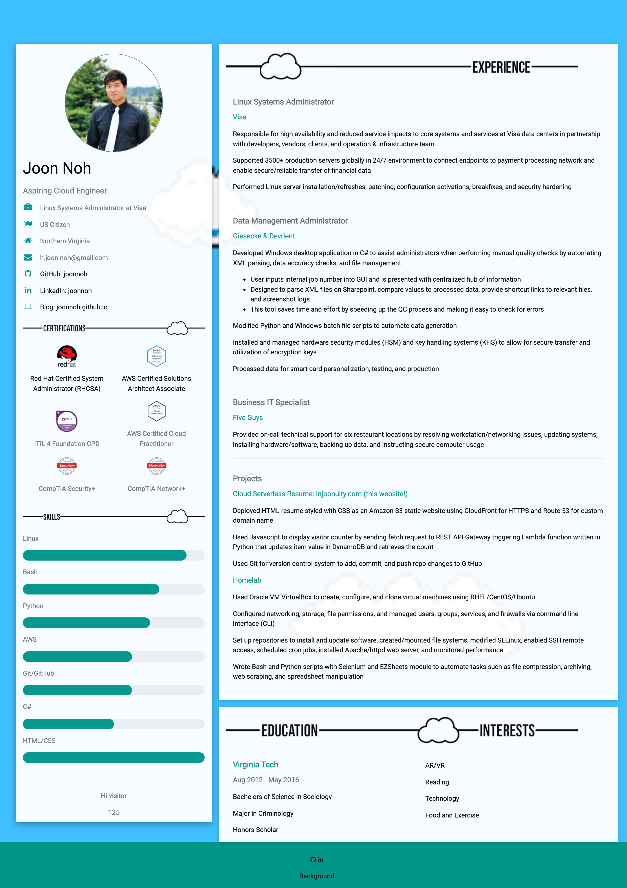

# injoonuity.com
Repository for cloud resume challenge @ [injoonuity.com](https://injoonuity.com)

Challenge accepted from [Forrest Brazeal](https://forrestbrazeal.com/2020/04/23/the-cloud-resume-challenge/)

Project to demonstrate knowledge and skills in full-stack software development, version control, infrastructure as code, automation, continuous integration and delivery, cloud services and serverless computing, application security, and networking.

**Completed**
1. AWS Certification (Solutions Architect Associate + Cloud Practitioner)
2. HTML (Resume)
3. CSS (Resume design)
4. Static S3 Website (S3)
5. HTTPS (CloudFront)
6. DNS (Route 53)
7. Javascript (Visitor Counter)
8. Database (DynamoDB)
9. API (API Gateway)
10. Python (Lambda)
11. Source Control (Git/GitHub)
12. Infrastructure as Code (Terraform)

**In Progress**

13. Backend CI/CD (GitHub Actions)
14. Frontend CI/CD (GitHub Actions)

**To Do**

15. Integration Tests (Cypress)
16. Blog posts
